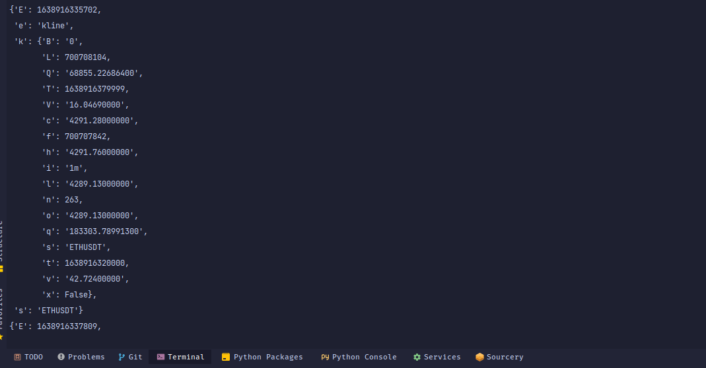
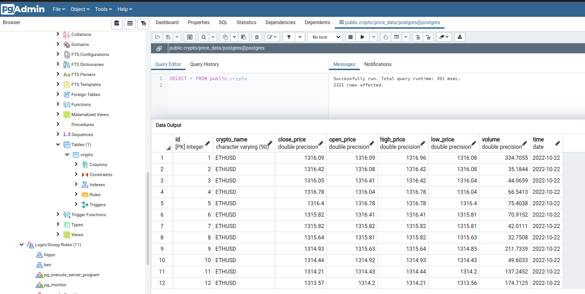

[](https://github.com/KenMwaura1/py-crypto-bot/actions/workflows/python-app.yml)
[![Contributors][contributors-shield]][contributors-url]
[![Forks][forks-shield]][forks-url]
[![Stargazers][stars-shield]][stars-url]
[![Issues][issues-shield]][issues-url]
[![MIT License][license-shield]][license-url]
[![LinkedIn][linkedin-shield]][linkedin-url]

<!-- PROJECT LOGO -->
<br />

<h3 align="center">Py Crypto Bot</h3>

  <p align="center">
    Using Binance WebSocket API to get real-time price data for cryptocurrencies. Store the data in a Postgres DB on candle close. Using the TA-Lib library to calculate the RSI and execute buy/sell orders.
    Currently supported pairs are ETH/USDT and BTC/USDT.
    <br />
    <br />
  </p>

<!-- TABLE OF CONTENTS -->
<details>
  <summary>Table of Contents</summary>
  <ol>
    <li>
      <a href="#about-the-project">About The Project</a>
      <ul>
        <li><a href="#built-with">Built With</a></li>
      </ul>
    </li>
    <li>
      <a href="#getting-started">Getting Started</a>
      <ul>
        <li><a href="#prerequisites">Prerequisites</a></li>
        <li><a href="#installation">Installation</a></li>
      </ul>
    </li>
    <li><a href="#usage">Usage</a></li>
    <li><a href="#roadmap">Roadmap</a></li>
    <li><a href="#contributing">Contributing</a></li>
    <li><a href="#license">License</a></li>
    <li><a href="#contact">Contact</a></li>
    <li><a href="#acknowledgments">Acknowledgments</a></li>
  </ol>
</details>

<!-- ABOUT THE PROJECT -->
## About The Project

[Link to accompanying article](https://dev.to/ken_mwaura1/crypto-data-bot-using-python-binance-websockets-and-postgresql-db-5fnd) :pencil2:




### Sample image of data stored in DB 


<!--Here's a blank template to get started: To avoid retyping too much info. Do a search and replace with your text editor for the following: `KenMwaura1`, `py-crypto-bot`, `Ken_Mwaura1`, `kennedy-mwaura`, `kemwaura`, `gmail.com`, `py-crypo-bot`, -->

<p align="right">(<a href="#top">back to top</a>)</p>

### Built With

* [Python 3.8+](https://www.python.org/downloads/)
* [Binance WebSocket API](https://github.com/binance/binance-spot-api-docs/blob/master/web-socket-streams.md#klinecandlestick-streams)
* [TA-Lib](https://mrjbq7.github.io/ta-lib/)

<p align="right">(<a href="#top">back to top</a>)</p>

<!-- GETTING STARTED -->
## Getting Started

To get started, you'll need to install the following:

### Prerequisites

This is an example of how to list things you need to use the software and how to install them.

* [Python 3.7+](https://www.python.org/downloads/)
* Postgresql Database.
  * This could either be installed [locally](https://www.postgresql.org/) or via  [docker](https://www.docker.com/).
      This [article](https://blog.crunchydata.com/blog/easy-postgresql-12-and-pgadmin-4-setup-with-docker) is an awesome resource on how to get Postgresql and pgadmin4  installed as containers.

    Create a database `price_data`. Either using SQL or 3-party client like pgadmin4 or [dbeaver](https://dbeaver.io/)

### Installation

1. Get a free API Key at [Binance](https://www.binance.com).
2. Clone the repo

   ```sh
   git clone https://github.com/KenMwaura1/py-crypto-bot.git
   ```

3. Create a virtual environment

   ```sh
   python -m venv venv
   ```

4. Activate the virtual environment

   ```sh
   source venv/bin/activate
   ```

5. Install the dependencies

   ```sh
   pip install -r requirements.txt
   ```

6. Add your credentials to a .env file

   ```sh
   echo "BINANCE_API_KEY=<your api key>" >> .env
   echo "BINANCE_API_SECRET=<your api secret>" >> .env
   ```

   OR
   Copy the provided example file to your .env file

   ```sh
   cp .env.example .env
   ```

7. Run the bot

   ```sh
   python bot.py
   ```

<p align="right">(<a href="#top">back to top</a>)</p>

See the [open issues](https://github.com/KenMwaura1/py-crypto-bot/issues) for a full list of proposed features (and known issues).

<p align="right">(<a href="#top">back to top</a>)</p>

<!-- CONTRIBUTING -->
## Contributing

Contributions are what make the open source community such an amazing place to learn, inspire, and create. Any contributions you make are **greatly appreciated**.

If you have a suggestion that would make this better, please fork the repo and create a pull request. You can also simply open an issue with the tag "enhancement".
Don't forget to give the project a star! Thanks again!

1. Fork the Project
2. Create your Feature Branch (`git checkout -b feature/AmazingFeature`)
3. Commit your Changes (`git commit -m 'Add some AmazingFeature'`)
4. Push to the Branch (`git push origin feature/AmazingFeature`)
5. Open a Pull Request

<p align="right">(<a href="#top">back to top</a>)</p>

<!-- LICENSE.txt -->
## License

Distributed under the MIT License. See `LICENSE.txt` for more information.

<p align="right">(<a href="#top">back to top</a>)</p>

<!-- CONTACT -->
## Contact

 [@Ken_Mwaura1](https://twitter.com/Ken_Mwaura1) - <kemwaura@gmail.com>

Project Link: [https://github.com/KenMwaura1/py-crypto-bot](https://github.com/KenMwaura1/py-crypto-bot)

<p align="right">(<a href="#top">back to top</a>)</p>

<!-- MARKDOWN LINKS & IMAGES -->
<!-- https://www.markdownguide.org/basic-syntax/#reference-style-links -->
[contributors-shield]: https://img.shields.io/github/contributors/KenMwaura1/py-crypto-bot.svg?style=for-the-badge
[contributors-url]: https://github.com/KenMwaura1/py-crypto-bot/graphs/contributors
[forks-shield]: https://img.shields.io/github/forks/KenMwaura1/py-crypto-bot.svg?style=for-the-badge
[forks-url]: https://github.com/KenMwaura1/py-crypto-bot/network/members
[stars-shield]: https://img.shields.io/github/stars/KenMwaura1/py-crypto-bot.svg?style=for-the-badge
[stars-url]: https://github.com/KenMwaura1/py-crypto-bot/stargazers
[issues-shield]: https://img.shields.io/github/issues/KenMwaura1/py-crypto-bot.svg?style=for-the-badge
[issues-url]: https://github.com/KenMwaura1/py-crypto-bot/issues
[license-shield]: https://img.shields.io/github/license/KenMwaura1/py-crypto-bot.svg?style=for-the-badge
[license-url]: https://github.com/KenMwaura1/py-crypto-bot/blob/master/LICENSE.txt
[linkedin-shield]: https://img.shields.io/badge/-LinkedIn-black.svg?style=for-the-badge&logo=linkedin&colorB=555
[linkedin-url]: https://linkedin.com/in/kennedy-mwaura/
